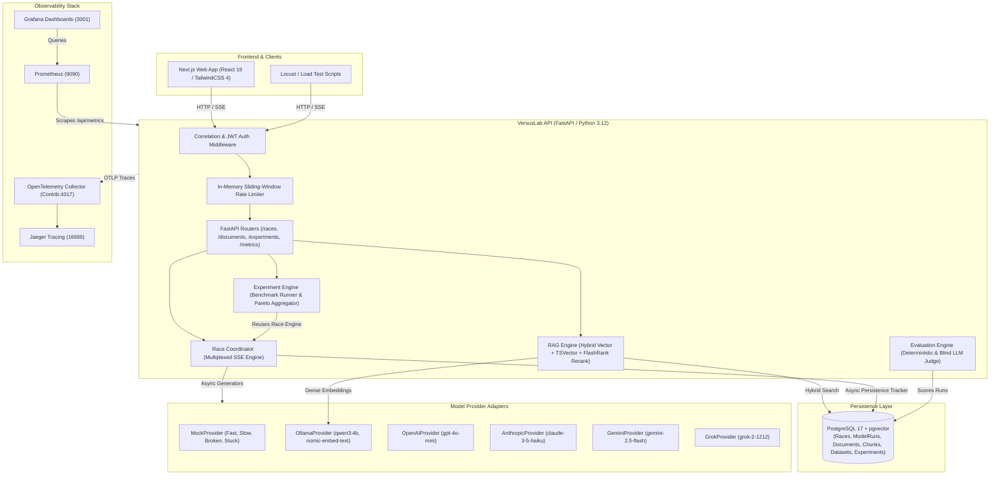

# VersusLab Architecture & System Design

This document details the complete, end-to-end architecture of **VersusLab** as **actually built** across Phases 1 through 10.

---

## 1. High-Level Architecture Diagram

---

## 2. Core Architectural Pillars

### A. Multiplexed Server-Sent Events (SSE) Streaming Engine
- **Single Connection Guarantee**: Instead of the browser establishing multiple HTTP streams, one multiplexed SSE stream is opened per race (`POST /api/races`).
- **Unified Event Protocol**: Every event is typed via Pydantic (`RaceEvent`) with fields: `sequence`, `race_id`, `model_id`, `type`, `text`, `usage`, `finish_reason`, `error`.
- **Strict Monotonic Sequence Ordering**: `sequence` (0, 1, 2, ...) is stamped in exactly one place: inside `run_race()` immediately prior to yielding to the client.
- **Fairness Guarantee (Rule 6)**: A single shared `ModelRequest` template is created once for all contenders; only the model identifier differs. When RAG context is attached, it is canonicalized and hashed via SHA-256; if context hashes ever diverge between contenders, the race is invalid.
- **Async Concurrency & Safe Retry**:
  - Global `asyncio.Semaphore(settings.max_concurrent_model_calls)` prevents socket exhaustion.
  - Safe retry policy: transient connection errors (`ConnectError`, `ConnectTimeout`) are retried up to `MAX_CONNECTION_RETRIES` **only before the first token has streamed**. Once any token is emitted, requests are non-idempotent and retry is forbidden.
  - Failure isolation ("Errors are Data"): a model failing, hanging, or crashing never interrupts other contenders or breaks the SSE connection. Failures are converted into `model.error`, `model.timeout`, or `model.cancelled` data events.

### B. Advanced Hybrid RAG Pipeline
- **Chunking**: Sentence-boundary-aware recursive text chunking with paragraph preservation.
- **Dense Vector Search**: PostgreSQL `pgvector` storing 768-dimensional embeddings generated via `nomic-embed-text` (or `MockEmbeddingProvider`).
- **Lexical BM25 / Full-Text Search**: Native PostgreSQL `tsvector` with English stemming and `ts_rank`.
- **Reciprocal Rank Fusion (RRF)**: Fuses rank positions from vector and lexical results using `Score(d) = 1 / (60 + rank_v) + 1 / (60 + rank_l)`.
- **Cross-Encoder Reranking**: Re-ranks top candidates using `flashrank` (`ms-marco-MiniLM-L-12-v2`) in a non-blocking thread pool (`asyncio.to_thread`).
- **Prompt Injection Boundaries**: Retrievable documents are untrusted passive evidence. Delimiters surround retrieved evidence with explicit system instructions to ignore prompt-override directives within document chunks.

### C. Comprehensive Evaluation Framework
- **Deterministic Evaluators**:
  - `exact_match(predicted, ground_truth, ignore_case, strip_whitespace)`
  - `regex_match(text, pattern)`
  - `json_schema_validity(text, json_schema)`
- **Information Retrieval Metrics**:
  - `precision_at_k(retrieved, gold, k)`
  - `recall_at_k(retrieved, gold, k)`
  - `reciprocal_rank(retrieved, gold)` (MRR)
- **Blind LLM-as-Judge**:
  - Shuffles contenders and assigns anonymous labels (`Answer A`, `Answer B`, etc.) so model brand or position cannot bias judging.
  - Scores 4 dimensions: correctness, relevance, completeness, instruction following.
- **Citation Faithfulness**:
  - Verifies deterministic citation tags `[S1]`, `[S2]`.
  - Evaluates whether cited claims are genuinely supported by the retrieved document chunks.
- **Decimal Cost Calculator**:
  - Token-exact cost calculations using `Decimal` quantized to 6 places ($0.000001 precision) based on confirmed provider pricing per 1M tokens.

### D. Experiment Engine & Pareto Trade-Off Analysis
- **Immutable Benchmark Datasets**: Datasets and test cases (`benchmark_datasets`, `benchmark_cases`) are versioned and immutable.
- **Engine Reuse**: Experiments run cases through the exact same `run_race` engine and `RacePersistenceTracker` as live races.
- **Pareto Trade-Off Aggregation**: Computes per-model averages across Quality Score vs Mean Latency (seconds) vs Total Cost (USD) vs TTFT.
- **Automated CI Quality Regression Gate**: Pull requests run a regression check (`scripts/run_ci_regression.py`) asserting that model contenders meet minimum quality score baselines and maximum latency thresholds.

### E. Production Hardening & Security (Phase 10)
- **Argon2id Password Hashing**: Utilizes `pwdlib[argon2]` for memory-hard password hashing.
- **JWT Authentication**: `pyjwt` signed tokens (`HS256`) enforced via FastAPI dependency `get_current_user` across all state-changing and data-reading endpoints.
- **In-Memory Rate Limiting**: Sliding-window rate limiting on `POST /api/races` and `POST /api/documents`.
- **Request Size & MIME Validation**: Strict file size limits (5MB) and UTF-8 / MIME verification on document uploads.
- **Structured JSON Logging**: Custom JSON log formatter with `X-Request-ID` correlation across requests and race events.
- **OpenTelemetry & Jaeger**: Distributed tracing instrumenting FastAPI, HTTPX client calls, and SQLAlchemy database queries.
- **Prometheus & Grafana**: `/api/metrics` endpoint exposing operational counters and latency histograms, visualized in auto-provisioned Grafana dashboards.

---

## 3. Explicitly Deferred & Simplified Items

Per project requirements and design scope, the following intentional simplifications were adopted:
1. **Single-User Authentication**: Designed for a portfolio demonstration. Multi-tenant RBAC/teams was explicitly omitted.
2. **In-Memory Rate Limiting**: Process-local sliding window was implemented. A distributed Redis cluster was deferred as multi-replica deployment is out of scope.
3. **Provider API Keys at Rest**: All provider keys live exclusively in `.env` and `Settings`. Database encryption at rest for API keys was unnecessary because keys are never stored in PostgreSQL or sent to the frontend.
4. **Text / Markdown Document Scope**: Ingestion supports `.txt` and `.md`. Multimodal OCR (PDF parsing, layout detection) was deferred for potential Phase 11.
5. **No Kubernetes**: Architecture is containerized via Docker and Docker Compose (`docker-compose.prod.yml`) without Kubernetes orchestration complexity.
